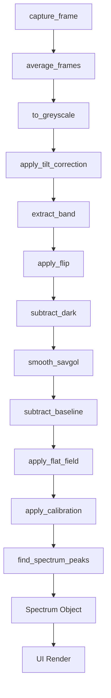

# Spectroo v3 Detailed Architecture Reference

This document provides a comprehensive technical guide to the architecture, design patterns, codebase organization, data pipeline, and system integration of the Spectroo v3 spectrometer application.

---

## SECTION 1 — Repository Structure

The Spectroo v3 application is organized into modular directories separating the acquisition, digital signal processing (DSP), persistent storage, desktop user interface, web interfaces, and diagnostic layers.

### Root Files and Directories

- **`config.toml`**
  The single source of truth for configuration settings across both desktop and web modes. It contains configuration blocks for the camera sensor, optical path settings, DSP parameters, calibration polynomials, web server parameters, sqlite database path, and standalone hotspot controls. It is parsed by `spectroo/core/config.py` and updated dynamically by the developer UI tools.
- **`main.py`**
  The main entry point of the application. It handles CLI parsing (e.g., `--mode`, `--dev`), triggers hardware/display detection to choose either desktop or web deployment modes, configures logging, loads the core config file, and kicks off either the PyQt5 application or the FastAPI server.
- **`pyproject.toml`**
  The project packaging and metadata definition file. It specifies build system requirements, python version compatibility (>=3.11), and runtime/dev dependencies. It includes optional markers to ensure that platform-specific modules like `picamera2` are only requested on Linux platforms.
- **`requirements.txt`**
  A standard pip requirements list pointing directly to specified dependency versions to pin execution environments during setup.
- **`scripts/`**
  Contains utility scripts for startup detection, system daemonization, and hotspot routing. It hosts `boot_detect.sh` (the environment wrapper that delegates to `main.py`), `setup_hotspot.sh` (access point configuration script), and the `systemd/` directory containing service unit stubs and the main `spectroo.service` unit.

### `spectroo` Submodules

- **`spectroo/core/`**
  The core domain logic of the application.
  - **`config.py`**: Handles loading, parsing, and structured reading of the configuration values using standard python libraries.
  - **`models.py`**: Defines structured dataclasses used throughout the data pipeline, such as `CalibrationPoint`, `Peak`, `Spectrum`, and `HistoryRecord`.
  - **`calibration.py`**: Hosts the mathematics for fitting calibration polynomial curves using least-squares regressions.
  - **`grating_model.py`**: Provides lookup table (LUT) mathematical models mapping pixel indices to wavelengths using the grating diffraction equation. (Used exclusively in tests).
  - **`exceptions.py`**: Defines standard custom exceptions like `CameraNotFoundError` and `CalibrationError` to catch expected errors gracefully.
- **`spectroo/camera/`**
  Handles sensor interfacing.
  - **`source.py`**: Defines the `FrameSource` abstract base class, `PiCameraFrameSource` (the hardware controller implementing dynamic `picamera2` integration), and `MockFrameSource` (the synthetic frame generator which generates simulated bands for off-hardware testing).
  - **`startup_calibration.py`**: Runs auto-alignment and calibration procedures (tilt, center row, and spectral flip detection) during hardware initialization (used in tests).
- **`spectroo/dsp/`**
  The digital signal processing core.
  - **`pipeline.py`**: Integrates all frame-level and spectrum-level filtering steps into a single logical execution flow.
  - **`collapse.py`**: Extracts 1D arrays from 2D sensor grids by averaging rows around the optical center and handles spatial flips.
  - **`corrections.py`**: Hosts functions for dark-frame subtraction and flat-field response correction.
  - **`filters.py`**: Houses smoothing operations (Savitzky-Golay) and baseline estimation techniques.
  - **`peaks.py`**: Implements peak-finding heuristics and prominence-based ranking.
- **`spectroo/storage/`**
  Persistent storage and serialization.
  - **`db.py`**: Interacts with the SQLite database, handling connection creation, schema initialization, inserting records, retrieving historical data, and enforcing a maximum FIFO database size limit.
  - **`export.py`**: Exports records to raw JSON formats or tab-delimited CSV formats.
- **`spectroo/ui/`**
  The desktop graphical interface.
  - **`main_window.py`**: The parent PyQt5 window that holds the graph and control panels, manages multi-threaded worker creation, and routes UI actions to the pipeline.
  - **`plot_widget.py`**: The custom QPainter-based visualization widget that draws the spectrum curve, gradient fill, peak tags, crosshairs, zoom/pan states, and secondary calibration axes without external plotting libraries.
  - **`control_panel.py`**: Holds controls for start/stop, live/single modes, exposure timing, baseline toggles, and shortcuts to dev utilities.
  - **`status_bar.py`**: Displays system state alerts (e.g., whether a dark frame is loaded or calibration is active) and highlights detected peak wavelengths.
  - **`history_panel.py`**: Displays a sidebar lists of saved spectrum records for immediate loading and rendering.
  - **`workers.py`**: Implements QThreads (`LivePipelineWorker`, `SingleAcquisitionWorker`, `DarkFrameWorker`, and `FlatFieldWorker`) to prevent blocking the GUI thread during long exposure runs, heavy DSP operations, or flat-field calibration captures.
  - **`theme.py`**: Standardizes fonts, color variables, borders, and paddings across all widgets.
- **`spectroo/ui/dev/`**
  Developer-only PyQt5 views.
  - **`calibration_window.py`**: An interactive wizard allowing developers to click peaks in the live spectrum, enter reference wavelengths, run polynomial fits, and apply them.
  - **`camera_preview_window.py`**: A diagnostic panel displaying raw 2D frames from the camera, assisting in physical alignment and exposure testing.
  - **`config_editor.py`**: Unimplemented placeholder for an interactive developer TOML editor.
- **`spectroo/web/`**
  Hosts the standalone hotspot interface.
  - **`app.py`**: Initializes the FastAPI server.
  - **`routes.py`**: Serves static HTML pages (dashboard, history, dev tools).
  - **`routes_dev.py`**: Unimplemented placeholder for developer REST actions.
  - **`ws.py`**: Manages WebSockets for real-time streaming of spectrum graphs to browser clients.
  - **`static/`**: Houses CSS styling, Javascript logic, and raw HTML templates for browser rendering.

---

## SECTION 2 — DSP Pipeline (Per Frame, Step-by-Step)

The data pipeline runs sequentially for each frame collected by the acquisition thread. Below is the detailed trace of data flows, shape conversions, types, and controlling keys.



### 1. Camera Capture
- **Location:** `spectroo/camera/source.py`
- **Action:** Captures frame data from the physical camera.
- **Underlying Call:** Calls `self._picam2.capture_array()` on Pi or generates synthetic bands via `np.random.default_rng().normal()` on mock environments.
- **Data Shape & DType:** Output is a 3D NumPy array of shape `(H, W, 3)` (RGB) or `(H, W)` (Grayscale), Type: `uint8`.
- **Config Key:** `[camera.resolution]` (e.g., `[2592, 200]`).

### 2. Frame Stacking / Averaging
- **Location:** `spectroo/dsp/pipeline.py` -> `average_frames()`
- **Action:** Stacks multiple consecutive captures to improve signal-to-noise ratio.
- **Underlying Call:** `np.mean(frames_list, axis=0)`.
- **Data Shape & DType:** Input: `N` arrays of `(H, W, 3)`. Output: `(H, W, 3)`, Type: `float32`.
- **Config Key:** `[camera.frame_stack]` (e.g., `1`).

### 3. Greyscale Conversion
- **Location:** `spectroo/dsp/pipeline.py` -> `to_greyscale()`
- **Action:** Converts 3-channel RGB data into a single intensity plane using standard luminance coefficients.
- **Underlying Call:** `np.dot(frame[..., :3], [0.299, 0.587, 0.114])`.
- **Data Shape & DType:** Input: `(H, W, 3)` `float32`. Output: `(H, W)` `float32`.
- **Config Key:** N/A.

### 4. Tilt Correction
- **Location:** `spectroo/dsp/pipeline.py` -> `apply_tilt_correction()`
- **Action:** Rotates the image plane to align the spectrum horizontally with the pixel matrix.
- **Underlying Call:** `scipy.ndimage.rotate(frame_2d, angle, reshape=False, order=1)`.
- **Data Shape & DType:** Input: `(H, W)` `float32`. Output: `(H, W)` `float32`.
- **Config Key:** `[optics.tilt_angle_deg]` (e.g., `0.0` or custom rotation).

### 5. Band Extraction
- **Location:** `spectroo/dsp/collapse.py` -> `extract_band()`
- **Action:** Collapses the vertical rows of the 2D image around the central optical path to extract a 1D pixel intensity signal.
- **Underlying Call:** Collapses rows using a vertical slicing window and takes the mean: `np.mean(frame_2d[y_start:y_end, :], axis=0)`.
- **Data Shape & DType:** Input: `(H, W)` `float32`. Output: `(W,)` `float32` (typically `2592` elements).
- **Config Key:** `[optics.center_y]` and `[dsp.band_half_height]`.

### 6. Spectral Flip
- **Location:** `spectroo/dsp/collapse.py` -> `apply_flip()`
- **Action:** Flips the 1D intensity array horizontally if the physical grating disperses light in the reverse direction.
- **Underlying Call:** Slices backwards: `array[::-1]`.
- **Data Shape & DType:** Input: `(W,)` `float32`. Output: `(W,)` `float32`.
- **Config Key:** `[optics.flip_spectrum]`.

### 7. Dark Subtraction
- **Location:** `spectroo/dsp/corrections.py` -> `subtract_dark()`
- **Action:** Subtracts the background sensor noise (captured with lens closed).
- **Underlying Call:** Element-wise subtraction: `np.clip(intensity - dark_frame, 0, None)`. Prior to subtraction, the file is loaded via the `load_dark_frame()` helper in `corrections.py`, which validates the file integrity and reports success/failure (rather than silently failing or guessing based on file existence).
- **Data Shape & DType:** Input: `(W,)` `float32`. Output: `(W,)` `float32`.
- **Config Key:** `[storage.dark_frame_path]`.

### 8. Savitzky-Golay Smoothing
- **Location:** `spectroo/dsp/filters.py` -> `smooth_savgol()`
- **Action:** Smooths high-frequency sensor noise while preserving sharp emission peak boundaries.
- **Underlying Call:** `scipy.signal.savgol_filter(intensity, window_length, polyorder)`.
- **Data Shape & DType:** Input: `(W,)` `float32`. Output: `(W,)` `float32`.
- **Config Key:** `[dsp.savgol_window]` and `[dsp.savgol_polyorder]`.

### 9. Baseline Subtraction
- **Location:** `spectroo/dsp/filters.py` -> `subtract_baseline()`
- **Action:** Removes slow-varying background illumination (e.g., continuous thermal glow) using a dynamic sliding window approach.
- **Underlying Call:** Estimates baseline profile by applying `scipy.ndimage.minimum_filter1d` with size `2 * max(1, len(intensity_1d) // 20)` and mode `'nearest'`, followed by secondary smoothing via `scipy.signal.savgol_filter` (using window size `min(51, len(intensity_1d))` adjusted to be odd and greater than or equal to 3 to support short mock inputs dynamically, and polynomial degree 2), and subtracts this profile: `np.clip(intensity_1d - baseline, 0, None)`.
- **Data Shape & DType:** Input: `(W,)` `float32`. Output: `(W,)` `float32`.
- **Config Key:** `[dsp.baseline_method]`, `[dsp.baseline_window]` (or baseline window size mapped internally), and `[dsp.baseline_polyorder]`.

### 10. Flat-Field Correction
- **Location:** `spectroo/dsp/corrections.py` -> `apply_flat_field()`
- **Action:** Divides the intensity by the baseline sensitivity curve of the sensor.
- **Underlying Call:** Division: `intensity / flat_field_response`. Prior to correction, the flat field response file is loaded via the `load_flat_field()` helper in `corrections.py`, which validates the file structure/integrity and reports success/failure.
- **Data Shape & DType:** Input: `(W,)` `float32`. Output: `(W,)` `float32`.
- **Config Key:** `[storage.flat_field_path]`.

### 11. Wavelength Calibration Mapping
- **Location:** `spectroo/core/calibration.py` -> `apply_calibration()`
- **Action:** Maps the horizontal pixel indices to absolute wavelengths (nanometers).
- **Underlying Call:** `np.polyval(coefficients, pixel_indices)`.
- **Data Shape & DType:** Input: `(W,)` pixel indices. Output: `(W,)` `float64` representing nanometers.
- **Config Key:** `[calibration.coefficients]`.

### 12. Peak Identification
- **Location:** `spectroo/dsp/peaks.py` -> `find_spectrum_peaks()`
- **Action:** Identifies emission or absorption lines in the smoothed profile.
- **Underlying Call:** `scipy.signal.find_peaks(intensity, prominence=thresh, distance=min_dist)`.
- **Data Shape & DType:** Input: `(W,)` `float32`. Output: List of integer indices corresponding to peak positions.
- **Config Key:** `[peaks.prominence_pct]`, `[peaks.prominence_min]`, and `[peaks.min_distance_px]`.

### 13. Spectrum Object Assembly
- **Location:** `spectroo/ui/main_window.py` -> `_on_frame_ready()`
- **Action:** Bundles all values into a structured format for storage and UI display.
- **Data Model:** Structured `Spectrum` object containing coordinates, timestamps, metadata, and list of `Peak` elements.

### 14. UI Render
- **Location:** `spectroo/ui/plot_widget.py`
- **Action:** Painstakingly draws the spectrum data using `QPainter` vectors. It performs coordinate transformations from data coordinate space to screen pixel coordinate space and redraws.

---

## SECTION 3 — Calibration System

The Spectroo v3 application maps pixel coordinates to wavelengths via least-squares polynomial regressions.

### Calibration Fitting Mechanics
The utility `fit_calibration(points, degree_low=2, degree_high=3, degree_threshold_points=4, min_points=2)` in `spectroo/core/calibration.py` accepts a list of `CalibrationPoint` structures.
- Fits a polynomial $P(x) = c_d x^d + c_{d-1} x^{d-1} + \dots + c_0$ using:
  ```python
  coefficients = np.polyfit(pixels, wavelengths, degree)
  ```
- Returns a `PolynomialCalibration` containing the coefficients list, the polynomial degree, and the calculated Root Mean Square (RMS) error (`rms_nm`):
  $$\text{RMS} = \sqrt{\frac{1}{N} \sum_{i=1}^N (P(x_i) - \lambda_i)^2}$$

### Coefficient Storage Format
In `config.toml`, coefficients are saved inside the `[calibration]` section:
```toml
[calibration]
coefficients = []
degree = 3
n_points = 0
```
These coefficients are stored in **highest-degree-first order** (i.e. $c_3, c_2, c_1, c_0$ for a cubic fit). This aligns directly with standard NumPy math, allowing absolute wavelengths to be calculated across all pixel indices using:
```python
wavelengths = np.polyval(coefficients, pixel_indices)
```

### The Historical Coefficient Order Bug
In early implementations of the developer interface (`spectroo/ui/dev/calibration_window.py`), the `_on_apply` method contained a bug where the coefficients array returned by `fit_calibration` was reversed before writing to the config:
```python
# BUGGY HISTORICAL CODE
coefs_low_to_high = list(reversed(self._fit_result.coefficients))
```
This reversed list (storing lowest-degree coefficients first, e.g. $c_0, c_1, c_2, c_3$) was written to `config.toml`. However, the acquisition pipeline loaded these coefficients and evaluated them using `np.polyval()`, which expects highest-degree-first. This resulted in garbled wavelength scales on startup.

**The Fix:**
The reversal was removed so that the coefficients are saved exactly in the highest-degree-first order returned by `np.polyfit()`:
```python
# CORRECTED WORKING CODE
coefs_low_to_high = list(self._fit_result.coefficients)
```

### Calibration UI Workflow
```
[User clicks peaks in CalibrationCanvas] 
                   │
                   ▼
[QInputDialog prompts for wavelength in nm]
                   │
                   ▼
[Point added to CalibrationPointsTable list]
                   │
                   ▼
[Click "Run Fit" -> Calls fit_calibration()] ──> (Renders red polynomial line on canvas)
                   │
                   ▼
[Click "Apply & Close" -> Overwrites config.toml]
```

---

## SECTION 4 — Camera Layer

Interfacing with the camera sensor is split between real hardware access and simulated runs.

### `PiCameraFrameSource` vs `MockFrameSource`
- **`MockFrameSource`**: Used on non-Pi platforms. Generates synthetic 2D frames using Gaussian profiles representing emission lines combined with white noise.
- **`PiCameraFrameSource`**: Connects to the Pi camera hardware. It dynamically imports `picamera2` to avoid crash-on-load issues when running on Windows/Mac development machines.

### The Dynamic Method Indentation Bug
A bug existed in `spectroo/camera/source.py` where the methods `capture_frame()`, `set_exposure_us()`, and `close()` for the `PiCameraFrameSource` class were indented too far, placing them inside the class's `__init__` constructor instead of at the class definition level. This meant external callers could not invoke them, resulting in runtime errors on Pi units. The code was refactored, dedenting these methods to the class level.

### Exposure Configuration
Exposure is controlled via:
```python
def set_exposure_us(self, exposure_us: int) -> None:
    self._picam2.set_controls({"ExposureTime": exposure_us})
```
This updates the sensor exposure in microseconds. The ArduCAM OV5647 supports exposure values ranging from `110 µs` to `3,066,979 µs`.

---

## SECTION 5 — UI Layer

The Spectroo UI layer is built on PyQt5 and uses a custom vector plotting widget rather than heavy external libraries like matplotlib.

### Main Components and Interactions

```
┌────────────────────────────────────────────────────────┐
│                   SpectrooMainWindow                   │
├──────────────────────────┬─────────────────────────────┤
│                          │                             │
│    SpectrumPlotWidget    │        ControlPanel         │
│     (Custom QPainter)    │   (Start, Stop, Exposure)   │
│                          │                             │
├──────────────────────────┴─────────────────────────────┤
│                      StatusBar                         │
└────────────────────────────────────────────────────────┘
```

- **`SpectrooMainWindow`**
  The central controller class. It initializes components, configures thread workers (`LivePipelineWorker`, `SingleAcquisitionWorker`, `DarkFrameWorker`) by passing the shared `self._frame_source` instance, connects signals, and handles overall window lifecycle events.
- **`ControlPanel`**
  Contains interactive elements. Emits `mode_changed`, `start_requested`, `stop_requested`, `exposure_changed`, `plot_mode_changed`, and `shutdown_requested` signals.
- **`SpectrumPlotWidget`**
  Renders the 1D spectrum curve. It accepts inputs through `set_data(wavelengths, intensities, peaks)` and redraws the graph using standard vector operations.
- **`StatusBar`**
  Displays diagnostic status dictionary inputs including FPS, peak listings, dark frame loading state, flat field loading state, and calibration validity. Both dark frame and flat field indicators are updated live per-frame from the results of the execution run of the DSP pipeline.
- **`HistoryPanel`** (Hidden from layout)
  Side-dockable list that loads and displays database rows. Retained in the codebase but removed from the visible UI layout to lock down non-dev options.

### Developer Views
- **`CalibrationWindow`**
  Allows live data plotting alongside an interactive points builder. Displays live pixel intensities, lets developers double-click peaks to input wavelengths, and runs `fit_calibration`. The live display (`_update_spectrum`, called every 200 ms via `QTimer`) now applies dark subtraction (via `load_dark_frame()` helper, with 2D→1D collapse using `apply_tilt_correction` for non-zero tilt) and baseline subtraction (gated on `dsp.baseline_enabled`, using the same `baseline_method/window/polyorder` config values as `run_pipeline`). Flat-field correction and Savitzky-Golay smoothing are intentionally omitted — calibration depends on unsmoothed raw peak positions for accurate pixel-to-wavelength clicks.
- **`CameraPreviewWindow`**
  Displays raw 2D frames at 10 FPS. Provides physical lens alignment validation. Includes an **Apply** button which commits exposure times to both the loaded memory config and the active `FrameSource`.

---

## SECTION 6 — Storage Layer

The storage layer relies on SQLite for metadata and raw spectrum arrays, and local binaries for calibrations and dark frames.

### SQLite Database Schema
The database (`data/spectroo.db`) contains a single table:
```sql
CREATE TABLE IF NOT EXISTS history (
    id INTEGER PRIMARY KEY AUTOINCREMENT,
    timestamp TEXT NOT NULL,
    exposure_us INTEGER NOT NULL,
    pixel_indices TEXT NOT NULL,      -- JSON-serialized array
    intensity TEXT NOT NULL,          -- JSON-serialized array
    wavelengths TEXT,                 -- JSON-serialized array (NULL if uncalibrated)
    peaks TEXT,                       -- JSON-serialized list of Peak dicts
    png_path TEXT NOT NULL,           -- Path to thumbnail image
    calibration_rms_at_capture REAL              -- RMS fit error
);
```

### Storage Functions
- **`init_db(db_path)`**: Connects to the database and initializes schemas.
- **`save_record(db_path, record, max_entries)`**: Writes a `HistoryRecord` to the database.
- **`get_record(db_path, record_id)`**: Retrieves a row and parses the JSON fields back into NumPy arrays and Python objects.
- **FIFO Database Pruning**: Inside `save_record`, if the database count exceeds `max_entries` (default: 500), it automatically deletes the oldest records:
  ```sql
  DELETE FROM history WHERE id IN (
      SELECT id FROM history ORDER BY timestamp ASC LIMIT ?
  );
  ```

### File Exports
- **`export_json(record, path)`**: Saves the spectrum data structure as a JSON file.
- **`export_csv(record, path)`**: Saves the data as a comma-separated CSV file containing `pixel_index, intensity, wavelength_nm`.
- **`dark_frame.npy`**: Stored as a raw binary array using `np.save()` for dark subtraction.
- **`response_flat.json`**: Stores the sensor spectral sensitivity response curve to correct for non-uniform sensor gain.
- Note: The system tracks `dark_frame_loaded` and `flat_field_loaded` as real runtime load-success flags (in the `Spectrum` model and `run_pipeline` result), ensuring indicators reflect actual file parsing success rather than just checking if a file exists on disk.

---

## SECTION 7 — Configuration (`config.toml`)

All runtime options are configured via key-value parameters in `config.toml`.

| Section | Parameter | Type | Status | Description / Reader |
|---|---|---|---|---|
| **`[camera]`** | `resolution` | Array of 2 ints | Locked | Dimensions `[W, H]` (e.g. `[2592, 200]`). Loaded by `FrameSource`. |
| | `exposure_us` | Integer | Measured | Sensor exposure (e.g. `20000` µs). Read by `FrameSource` and UI. |
| | `frame_stack` | Integer | Assumed | Count of stacked frames (e.g. `1`). Read by `LivePipelineWorker` and `SingleAcquisitionWorker`. |
| **`[optics]`** | `tilt_angle_deg`| Float | Measured | Sensor skew rotation (e.g. `0.0`). Read by `apply_tilt_correction`. |
| | `flip_spectrum` | Boolean | Assumed | Flip spectrum horizontally (e.g. `false`). Read by `apply_flip`. |
| | `center_y` | Integer | Measured | Row index for spectrum center (e.g. `63`). Read by `extract_band`. |
| **`[dsp]`** | `band_half_height`| Integer | Assumed | Extraction row window (e.g. `15`). Read by `extract_band`. |
| | `savgol_window` | Integer | Assumed | Savitzky-Golay filter size (e.g. `11`). Read by `smooth_savgol`. |
| | `savgol_polyorder`| Integer | Assumed | Savitzky-Golay polynomial order (e.g. `3`). Read by `smooth_savgol`. |
| | `baseline_enabled`| Boolean | Assumed | Subtract continuous baseline. Read by `subtract_baseline`. |
| | `baseline_window`| Integer | Assumed | Baseline estimation filter window (e.g. `51`). Read by `subtract_baseline`. |
| | `baseline_polyorder`| Integer | Assumed | Baseline estimation polynomial order (e.g. `2`). Read by `subtract_baseline`. |
| **`[calibration]`**| `coefficients` | Array of floats| Measured | Polynomial terms. Read by `apply_calibration` and written by `CalibrationWindow`. |
| | `degree` | Integer | Assumed | Polynomial fitting degree (e.g. `3`). Read by `fit_calibration`. |
| | `n_points` | Integer | Measured | Points used for calibration (e.g. `0`). Written by `CalibrationWindow`. |
| **`[peaks]`** | `prominence_pct` | Float | Assumed | Percentage prominence threshold (e.g. `0.10`). Read by `find_spectrum_peaks`. |
| | `prominence_min` | Float | Assumed | Minimum prominence value (e.g. `0.01`). Read by `find_spectrum_peaks`. |
| | `min_distance_px` | Integer | Assumed | Minimum peak spacing in pixels (e.g. `20`). Read by `find_spectrum_peaks`. |
| **`[history]`** | `db_path` | String | Assumed | File path for SQLite database. Read by `db.py`. |
| | `max_entries` | Integer | Assumed | Maximum history records stored. Read by `save_record`. |
| **`[storage]`** | `dark_frame_path`| String | Assumed | File path for dark frame binary. Read by workers and pipeline. |
| | `flat_field_path`| String | Assumed | File path for response flat-field JSON array. Read by pipeline and written by `FlatFieldWorker`. |
| **`[web]`** | `host` | String | Locked | Bind address (e.g. `0.0.0.0`). Read by `main.py` (defaults to `0.0.0.0`). |
| | `internal_port` | Integer | Locked | Internal bind port for Uvicorn (e.g. `8000`). Read by `main.py`. |
| | `public_port` | Integer | Locked | Public external web port (e.g. `80`). |
| | `dev_password` | String | Locked | Authentication password for dev routes. Read by `routes.py`. |
| **`[hotspot]`** | `ssid` | String | Locked | Hotspot Access Point name. Read by AP setup script. |
| | `password` | String | Locked | Hotspot AP WPA password. Read by AP setup script. |

---

## SECTION 8 — Boot and Deployment

The startup sequence is managed by shell scripts and system daemons.

### Startup Pipeline and Mode Detection
The system startup sequence executes through a single unified process:
1. **Systemd Service**: At boot, `systemd` launches `spectroo.service` (defined in `scripts/systemd/spectroo.service`).
2. **Environment Wrapper**: The service executes `scripts/boot_detect.sh`, which loads the virtual environment (`.venv`) and passes execution to `main.py` via `exec python main.py "$@"`.
3. **Hardware Boot Detection**: `main.py` runs with default `--mode auto`, which calls `detect_boot_mode()` from `spectroo/system/boot_detect.py`.
4. **Display Check**: `detect_boot_mode()` inspects `/sys/bus/platform/drivers/vc4_dsi/` for a touchscreen, and scans `/sys/class/drm/card*-HDMI-*/status` for connected monitors. If either is found, it returns `"desktop"`; otherwise, it falls back to `"web"`.
5. **Execution Routing**: Based on the returned boot mode, `main.py` directly executes the PyQt5 application via `run_desktop()` or starts the Uvicorn/FastAPI server via `run_web()`.

### Hotspot and Network Deployment
When deployed headless, networking and routing are established once during deployment using `scripts/setup_hotspot.sh`:
- **Access Point & DHCP**: Configures `hostapd` to broadcast the SSID (default `"Spectroo"`, overridable via the `SPECTROO_SSID` environment variable) and `dnsmasq` to assign IP leases on the `wlan0` interface (default range `192.168.4.2-192.168.4.20`, overridable via the `SPECTROO_DHCP` environment variable).
- **Static IP Gateway**: Binds the wireless interface to the static IP gateway (default `192.168.4.1`, overridable via the `SPECTROO_IP` environment variable) inside `/etc/dhcpcd.conf`.
- **Port Forwarding**: Adds an `iptables` NAT PREROUTING rule to redirect TCP traffic on port `80` to the internal Uvicorn server port `8000` (overridable via the `SPECTROO_PORT` environment variable).
- **Avahi Daemon**: Configures `avahi-daemon` to resolve requests for `spectroo.local` to the hotspot gateway.

### Systemd Configuration (`spectroo.service`)
The primary systemd unit definition (located at `scripts/systemd/spectroo.service`) is:
```ini
[Unit]
Description=Spectroo v3 Spectrometer Application
After=network.target

[Service]
Type=simple
User=spectroo
WorkingDirectory=/home/spectroo/spectroo_v3
ExecStartPre=/bin/sleep 30
ExecStart=/home/spectroo/spectroo_v3/scripts/boot_detect.sh
Restart=on-failure
RestartSec=5
StandardOutput=journal
StandardError=journal
Environment=PYTHONUNBUFFERED=1

[Install]
WantedBy=multi-user.target
```
*(Note: systemd configuration stubs `spectroo-boot-detect.service`, `spectroo-desktop.service`, and `spectroo-web.service` exist in the repository as placeholder TODO stubs.)*

### Main Entry Mode Routing
In `main.py`, CLI parsing decides the runtime flow:
- `--mode auto` (default): Runs display interface detection to select `"desktop"` or `"web"` mode dynamically.
- `--mode desktop`: Forces PyQt5 GUI instantiation and execution.
- `--mode web`: Forces FastAPI/Uvicorn server binding.
- `--dev` / `--no-dev`: Enables or disables developer mode (default: True). Enables developer keyboard shortcuts (`Ctrl+Shift+D` calibration, `Ctrl+Shift+Q` dark frame, `Ctrl+Shift+F` flat field).

---

## SECTION 9 — Known Bugs and Workarounds

No known open bugs at this time.

---

## SECTION 10 — Test Suite

The test suite contains **130 automated tests** inside the `tests/` directory.

### Test Files and Coverage

- **`test_calibration.py` (7 tests)**
  Tests polynomial fitting logic, least-squares calculations, RMS error tracking, and wavelength conversions.
- **`test_camera.py` (5 tests)**
  Verifies that `MockFrameSource` generates valid arrays and handles exposure adjustments correctly.
- **`test_dev_calibration.py` (13 tests)**
  Validates `CalibrationWindow` actions, adding/deleting coordinates, and fitting functions. Includes tests for `_update_spectrum` dark subtraction (1D and 2D dark with nonzero tilt), baseline gating, and missing-file fallback.
- **`test_dsp.py` (15 tests)**
  Tests each DSP pipeline step including Savitzky-Golay filters, baseline calculations, tilt corrections, and the `baseline_enabled` gate in `run_pipeline`.
- **`test_flat_field.py` (5 tests)**
  Tests `FlatFieldWorker` capture sequence, missing dark frame fallbacks, divide-by-zero guards, clamping thresholds, and dev-mode gating of the shortcut.
- **`test_history_panel.py` (8 tests)**
  Tests loading, rendering, and selecting items in the UI history sidebar.
- **`test_main_window.py` (12 tests)**
  Tests window startup, signal routes, and thread worker creation.
- **`test_plot_widget.py` (10 tests)**
  Verifies coordinate scaling, gridlines, zoom/pan bounds, and cursor placements.
- **`test_startup_calibration.py` (8 tests)**
  Tests boot calibration loading and config parameter checks.
- **`test_storage.py` (14 tests)**
  Tests SQLite database creations, record insertions/queries, and CSV/JSON exports.
- **`test_system.py` (8 tests)**
  Tests platform detection and hardware diagnostic scripts.
- **`test_ui_widgets.py` (14 tests)**
  Verifies button behaviors, layout spacing, and control panel logging functions.
- **`test_web.py` (11 tests)**
  Tests the FastAPI router endpoints, WebSocket feeds, and data endpoints.
