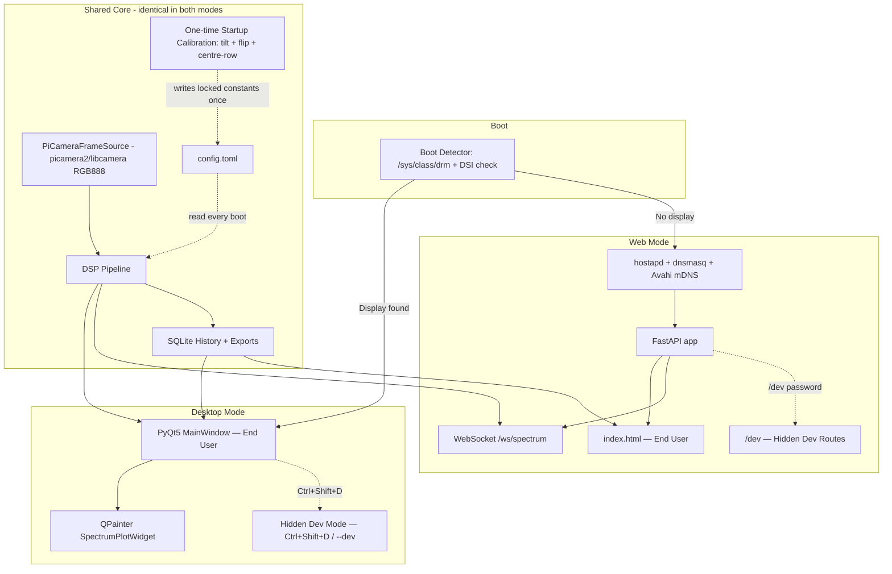

# Software Architecture Document (SAD)
## Spectroo v3 — Final End-User Spectrometer Application

---

**Document type:** Architecture Specification (pre-implementation)
**Hardware target:** Raspberry Pi 4 Model B · ArduCAM B0035 (OV5647 + IR filter) · Handheld diffraction grating gemological spectroscope
**Status:** Locked pending the on-hardware test series in §16. Several constants below are placeholders explicitly marked `TBD` until measured.
**Predecessors:** Spectroo Legacy (v1) and Spectroo v2 — this document supersedes both. See §17 for a full comparison.

### Document conventions
- **`TBD — Tn`** — value is unknown and is *measured* by hardware test `Tn` (§16). Do not treat placeholder numbers as design intent.
- **`ASSUMPTION`** — a decision made to keep the document moving; safe to override. All assumptions are also collected in §18.
- **`locked`** — a constant measured once (usually in dev mode) and then frozen in `config.toml`; the end-user app never recalculates it.
- **§n** — cross-reference to a section in this document.

---

## Table of contents

1. Project Overview
2. Hardware Platform
3. OS & System
4. Tech Stack
5. System Architecture
6. Repository / Package Structure
7. DSP Pipeline (per frame)
8. Wavelength Mapping — Grating Equation
9. UI — Desktop (PyQt5)
10. UI — Web (Hotspot Mode)
11. Storage & History
12. Calibration System (Dev Mode Only)
13. Configuration File (`config.toml`)
14. Deployment & Boot Orchestration
15. API Design (Web Mode)
16. Hardware Test Plan
17. Comparison: What v3 Keeps, Changes, and Drops
18. Open Items Requiring Confirmation Before Build
19. Non-Functional Requirements & Performance Budget *(new)*
20. Failure Modes & Degraded Operation *(new)*
21. Logging & Observability *(new)*
22. Security & Hardening *(new)*
23. Glossary *(new)*

> Sections 19–23 were added in this revision and are appended at the end so that every existing **§n** cross-reference in the body remains valid. They are forward-looking checklists, not finished specs.

---

## 1. Project Overview

Spectroo v3 is the final, end-user-facing version of the spectrometer application. It merges the best parts of v1 (pixel-perfect PyQt5/QPainter desktop UI, response flat-field correction, diagnostics math) and v2 (config-driven runtime, dual desktop/web deployment, async pipeline patterns), while removing everything that was developer-only scaffolding in either codebase.

### Key goals
- **Single visual identity** — desktop and web UI are visually and functionally identical, both modeled pixel-for-pixel on v1's PyQt5/QPainter design.
- **Zero-touch boot behavior** — the device decides for itself whether to be a desktop application or a Wi-Fi hotspot + web server, based on whether a display is attached.
- **Calibrate once, never again** — all optical constants (tilt, spectrum orientation, band centre-row, wavelength calibration) are measured once in a hidden developer mode and then hardcoded into `config.toml`. The end-user app never recalculates them.
- **Simple, dumbed-down end-user controls** — exposure is the only DSP parameter end users can touch. Everything else (band height, SG window, frame stack count) is locked and hidden.
- **A permanent, browsable record of every measurement** — every "Save Spectrum" action produces a SQLite-backed history entry with full-range PNG, CSV, and JSON, recoverable from both desktop and web UI.

---

## 2. Hardware Platform

| Component | Spec |
|---|---|
| Board | Raspberry Pi 4 Model B |
| Camera | ArduCAM B0035 — OV5647 sensor, **with IR filter** (not NoIR), M12×0.5 interchangeable lens mount, CSI ribbon |
| Lens | M12, 12mm focal length, **f/1.2 aperture** (assumed from typical M12 12mm specs — verify against the actual lens datasheet) |
| Sensor pixel size | 1.4µm / 0.00140mm — standard OV5647 datasheet value, not independently re-measured — verify during T2/T3 |
| Sensor native resolution | 2592×1944, cropped to 2592×200 for spectral capture |
| Spectroscope | Handheld diffraction grating gemological spectroscope (Amazon), ~55mm aluminum body, raster-type grating, grating line density **unknown — measured in T3** |
| Wavelength range | Stated as 400–650nm; note the product listing for this exact item describes 400–700nm — **confirm actual usable range during T3**, don't assume either figure |
| Camera-to-spectroscope coupling | 3D-printed adapter, **rigid and hard-fixed** — does not shift or rotate once mounted. This is the hardware property that justifies locking tilt, flip-orientation, and band centre-row as one-time constants rather than per-frame computations (see §7) |
| Display | HDMI now, DSI touchscreen possible later. Boot-time auto-detection of either |

---

## 3. OS & System

- **OS:** Raspberry Pi OS Lite, 64-bit, no desktop environment
- **Boot behavior:** 30-second warm-up delay after boot, then display detection, then branch to desktop app or hotspot+web (see §14)
- **Dedicated device** — nothing else runs on this Pi
- **Shutdown:** UI shutdown button (desktop and web) and a physical GPIO button both trigger a clean `sudo shutdown -h now`. GPIO pin not yet finalized — GPIO 3 suggested and is the strongest candidate because, in addition to its built-in pull-up, GPIO 3 is the only pin that also **wakes the Pi from a halted state** (a short press both shuts down a running Pi and powers a halted one back up). Confirm during the physical build, and note that wiring a button here means the I²C bus on GPIO 2/3 cannot also be used.

---

## 4. Tech Stack

| Layer | Choice | Source |
|---|---|---|
| Core language | Python ≥ 3.11 | v2 |
| Desktop GUI | PyQt5 + custom `QPainter` spectrum widget (not pyqtgraph) | v1 — pixel-perfect UI requirement overrides v2's pyqtgraph choice |
| Web backend | FastAPI + uvicorn | v2 |
| Web frontend | HTML5 Canvas + vanilla JS, light theme matching v1's white/grey palette (not v2's dark theme) | v1 visuals, v2 plumbing |
| DSP / math | numpy, scipy (`ndimage`, `signal`, `optimize`) | v1 + v2 |
| Config | `tomllib`, single `config.toml` | v2 |
| Storage | SQLite (history) + `.npy` (dark frame) + `.json` (response flat-field) | new for v3 — see §11 |
| Camera | `picamera2` / `libcamera`, requesting RGB888 directly (no manual Bayer/BGR handling needed) | v1 hardware adapter pattern, v2 abstraction interface |
| Local network discovery | Avahi (mDNS) advertising `spectroo.local` | new for v3 |
| Concurrency model (desktop) | **Open — pending T11.** Candidates: v1's QThread + Qt Signals, or v2's `AsyncLoopThread` + thread-safe `queue.Queue` polled by `QTimer`. Must be decided by running both under real camera load on the actual Pi 4B and comparing CPU usage and frame latency. |
| Packaging | `pyproject.toml`, editable install | v2 |
| Tests | `pytest` / `pytest-asyncio` | v2 |

---

## 5. System Architecture



The desktop and web presentation layers are thin shells over one shared core: the same camera source, the same DSP pipeline, the same SQLite history, and the same `config.toml`. Nothing in the DSP/storage layer is duplicated per-mode — this directly fixes v1's documented problem of DSP code drifting between files (e.g. the SG window 7-vs-13 bug).

---

## 6. Repository / Package Structure

```text
spectroo_v3/
├── config.toml
├── pyproject.toml
├── requirements.txt
├── main.py                          # Entry point, routed by boot-detect flag
├── scripts/
│   ├── boot_detect.sh                # HDMI/DSI check, writes flag file
│   ├── start_hotspot.sh              # NetworkManager wifi hotspot config
│   └── systemd/
│       ├── spectroo-boot-detect.service
│       ├── spectroo-desktop.service
│       └── spectroo-web.service
├── spectroo/
│   ├── __init__.py
│   ├── core/
│   │   ├── models.py                 # Spectrum, CalibrationPoint, HistoryRecord
│   │   ├── grating_model.py          # Grating equation LUT
│   │   ├── calibration.py            # Adaptive-degree polynomial fit + RMS
│   │   └── exceptions.py
│   ├── camera/
│   │   ├── source.py                 # PiCameraFrameSource (RGB888) + MockFrameSource
│   │   └── startup_calibration.py    # Combined tilt + flip + centre-row routine
│   ├── dsp/
│   │   ├── pipeline.py               # Per-frame DSP orchestrator (§7)
│   │   ├── collapse.py               # Band extraction using locked center_y
│   │   ├── corrections.py            # Dark subtraction, response flat-field
│   │   ├── filters.py                # SG smoothing + baseline (method per T6)
│   │   └── peaks.py                  # find_peaks, prominence ranking
│   ├── storage/
│   │   ├── db.py                     # SQLite schema + queries
│   │   └── export.py                 # On-demand CSV / JSON / PNG generation
│   ├── ui/                           # Desktop, PyQt5
│   │   ├── main_window.py
│   │   ├── plot_widget.py            # QPainter canvas, ported from v1
│   │   ├── control_panel.py
│   │   ├── history_panel.py
│   │   ├── theme.py
│   │   └── dev/
│   │       ├── calibration_window.py
│   │       ├── camera_preview_window.py
│   │       └── config_editor.py
│   ├── web/                          # FastAPI app
│   │   ├── app.py
│   │   ├── routes.py
│   │   ├── routes_dev.py
│   │   ├── ws.py
│   │   └── static/
│   │       ├── index.html
│   │       ├── history.html
│   │       ├── dev.html
│   │       └── theme.css
│   └── system/
│       ├── shutdown.py               # GPIO button + UI shutdown handler
│       └── boot_detect.py
└── tests/
    ├── test_dsp.py
    ├── test_calibration.py
    └── test_storage.py
```

Runtime layout on the Pi itself (separate from the repo above):

```text
~/spectroo/
├── config.toml
├── data/
│   ├── spectroo.db          # SQLite history
│   ├── dark_frame.npy       # Current dark reference
│   ├── response_flat.json  # Flat-field curve
│   ├── exports/             # On-demand CSV/JSON exports
│   └── thumbnails/          # Saved-spectrum PNGs (referenced by path, not stored as blobs)
├── logs/
│   └── spectroo.log
└── spectroo/                 # Installed package
```

---

## 7. DSP Pipeline (per frame)

This is the authoritative v3 order, reconciled from the real v1 pipeline (per the UI reference document) and adjusted for the rigid-mount optimizations agreed during cross-check.

| Step | Stage | Detail |
|---|---|---|
| 1 | Frame capture | 4 frames (pending T7) at `2592×200`, configured exposure, via `picamera2`/`libcamera` requesting **RGB888** directly — this avoids the manual BGR↔RGB channel-swap v1 needed |
| 2 | Averaging | Frames averaged to float32 |
| 3 | Greyscale | Luminance: `0.299R + 0.587G + 0.114B`, applied to the full 2D frame |
| 4 | **Locked tilt correction** | Apply the **static** rotation angle measured once during startup calibration (`config.toml: optics.tilt_angle_deg`) via `scipy.ndimage.rotate`. No per-frame detection — this is the key v3 optimization over both v1 and v2, justified by the rigid camera mount. |
| 5 | Band extraction | Extract `center_y ± band_half_height` (both **locked, hidden from end users**) → 1D array of `n_pixels` |
| 6 | **Locked flip correction** | If `config.toml: optics.flip_spectrum = true`, reverse the 1D array so violet is always on the low-index side. Measured once at startup, applied unconditionally every frame — this replaces v1's per-frame hue-gradient detection (`detect_spectrum_flip()`) with a free O(n) reversal. Note: this is **not** the same issue as the Bayer/RGB channel swap — that's already resolved by requesting RGB888 in step 1. |
| 7 | Dark subtraction | Subtract the user-captured dark reference, clip to 0. **Open issue (see §18.8):** a true dark frame can only be captured with the lens covered, so it cannot be silently re-captured mid-session while a sample is in view. The "60 s" figure is therefore reinterpreted as a **staleness timer** — after `dark_refresh_interval_s` the stored dark is flagged stale and the status bar prompts the user to re-cover and re-capture; nothing is re-captured automatically. T9 measures the real drift rate to set this interval (or to retire it in favour of exposure-scaled dark-current modelling). |
| 8 | SG smoothing | `window=7, polyorder=3` (locked single value — fixes v1's 7-vs-13 drift bug), pending T5 confirmation |
| 9 | Baseline subtraction | Method TBD — T6 decides between v1's `minimum_filter1d` + SG(51) or v2's SG-only baseline estimate. **Assumption pending your confirmation:** when the end-user toggle is ON, the result modifies the actual stored/exported signal (v1's behavior) rather than only affecting display/peak-detection (v2's behavior) — flag if you'd rather it be display-only. |
| 10 | Response flat-field correction | Divide by `response_flat.json` curve, clipped to a 0.001 floor, restored from v1 |
| 11 | Wavelength mapping | Polynomial calibration coefficients if calibrated, else grating equation LUT fallback (see §8) |
| 12 | Peak detection | `scipy.signal.find_peaks`, dynamic prominence. **All** detected peaks are kept for storage/export (uncapped); only the **live UI label display** caps at 3 |
| 13 | Render | Desktop: QPainter draw. Web: HTML5 Canvas draw via WebSocket payload |

### One-time Startup Calibration (combined routine, dev mode only)
Tilt angle, spectrum flip-orientation, and band centre-row are all measured together in a single dev-mode routine (per your confirmation), writing all three values into `config.toml` in one pass:
```toml
[optics]
tilt_angle_deg = <measured>
flip_spectrum = <measured boolean>
center_y = <measured>
```
Re-run only if the camera is ever physically remounted.

---

## 8. Wavelength Mapping — Grating Equation

```
θ = arctan( (x − centre_pixel) × pixel_size_mm / focal_length_mm )
λ = (1 / lines_per_mm) × sin(θ) × (1 / diffraction_order) × 10⁶
```

| Constant | Value | Status |
|---|---|---|
| `focal_length_mm` | 12.0 | Confirmed (measured M12 lens) |
| `pixel_size_mm` | 0.00140 | Assumed from OV5647 datasheet — verify |
| `lines_per_mm` | — | **TBD — T3** |
| `centre_pixel` | — | **TBD — startup calibration** |
| `diffraction_order` | 1 | Default, matches v2 |

This LUT is only the **fallback** used when the device is uncalibrated. The primary path is the polynomial fit from dev-mode calibration (see §12).

> **Model assumptions:** the `arctan` geometry treats `centre_pixel` as the zero-order (θ = 0) column and assumes the sensor plane is perpendicular to the optical axis. Both are approximations for a handheld grating scope, which is exactly why this path is fallback-only; the measured polynomial fit absorbs the residual geometric error.

---

## 9. UI — Desktop (PyQt5)

Visual spec ported pixel-for-pixel from the v1 UI reference document.

### Plot widget
- Background `#FFFFFF`, grid `#EEEEEE` at every X-axis tick
- Curve `#444444`, colour-mode fill = horizontal spectral gradient (violet→blue→green→yellow→red); plain-mode fill = solid mid-grey
- Peak markers: red dashed `#FF4444` with nm labels
- Inspect crosshair: grey dashed line placed on **left click** (not hover) at the clicked X position, with wavelength + intensity readout
- X axis: nm (20nm tick intervals) when calibrated, pixel index 0–2591 when not
- Y axis: 0–max with 15% headroom
- Margins: Left 65 · Right 35 · Top 35 · Bottom 50
- Zoom: scroll wheel, 20%/step toward cursor, minimum zoom range 5nm; Ctrl+drag pan; right-click or double-click resets to full view

### Control panel — End User Mode
- **MODE:** Single / Live toggle, default Single
  - Single → **Capture** button + Exposure (µs) input
  - Live → **Start** / **Stop** buttons + Exposure (µs) input
  - Exposure range 110–3,066,979µs, default 200,000µs
- **DISPLAY:** Colour Spectrum / Plain Spectrum toggle
- **DATA:**
  - **Capture Dark Frame** — shows a "cover the lens" prompt first, then captures and averages 4 frames. After `dark_refresh_interval_s` (default 60s) the dark is marked **stale** and the status bar suggests a re-capture; it is **not** silently re-captured, since that would require the lens to be covered again (see §7 step 7 and §18.8)
  - **Save Spectrum** — one click writes PNG + CSV + JSON to SQLite history. PNG always renders the **full data range** (ignores current zoom), circles the **top 5 peaks by prominence**, and labels each with its wavelength to **one decimal place**
  - **View History** — opens history panel
  - **Shutdown**
- No Calibrate button — moved to dev mode entirely

### Status bar
FPS · dark frame status · peak readout (capped at 3, nm) · system messages · calibration status (Calibrated/Uncalibrated) · mode indicator (Desktop/Web)

### Developer Mode (hidden — `--dev` launch flag or `Ctrl+Shift+D`)
Everything above, plus:
- **Calibrate...** — combined startup calibration routine (tilt + flip + centre-row) and the pixel→wavelength polynomial fit workspace (see §12)
- DSP parameter overrides (band height, SG window, frame stack)
- Response flat-field capture tool
- Live `config.toml` editor
- T1–T11 test triggers (§16)
- **Live Camera Feed** — full-resolution raw 2D sensor image with the band overlay drawn on top (two lines + semi-transparent rectangle, effectively free since the frame is already captured)

---

## 10. UI — Web (Hotspot Mode)

Mirrors the desktop UI exactly: same canvas colors/gradient, same panel sections in the same order, same status bar fields. Differences are purely in delivery mechanism, not appearance or behavior.

- **Network access:** connect to the Pi's hotspot, browse to **`spectroo.local`** (via Avahi/mDNS — same mechanism that makes a stock Pi answer to `raspberrypi.local`). Served on **port 80** via an iptables redirect from the app's internal port (8000), so no port number is ever needed in the URL. `192.168.4.1` remains available as a fallback for the small number of devices (mainly older Android/Chrome) with unreliable mDNS resolution.
- WebSocket for live spectrum streaming, REST for all button actions and history/export downloads
- No login for end-user access; single user at a time — a second connection gets a "device busy" notice
- Dev mode at `/dev`, password-protected via `config.toml`, live camera feed served as an MJPEG stream
- Touch support for a future touchscreen upgrade: tap = click (crosshair), pinch = zoom, single-finger drag = pan

---

## 11. Storage & History

- **Database:** SQLite at `~/spectroo/data/spectroo.db`
- **Per saved capture:**
  - `timestamp` (ISO 8601 UTC)
  - `exposure_us`
  - `pixel_indices`, `intensity`, `wavelengths` (null if uncalibrated)
  - `peaks` — **all** detected peak wavelengths, uncapped
  - `png_path` — file-path reference into `data/thumbnails/`, **not** a blob (keeps the DB file small, allows simple filesystem backup/browsing) — flagging this as an assumption, left as "blob OR path" undecided earlier
  - `calibration_rms_at_capture`
- **Export on demand:** CSV + PNG + JSON generated from the DB record when the user clicks download — not pre-generated
- **Storage cap:** configurable in `config.toml`, default 500 entries, oldest deleted (FIFO) when exceeded
- **Web access:** full history browsable via web UI, same as desktop, each entry downloadable

---

## 12. Calibration System (Dev Mode Only)

- Never exposed to end users. Output is written directly into `config.toml` as hardcoded constants; the end-user app reads these on every boot and never recalculates them. Optical setup must not move after calibration — if it does, dev mode must be re-run.
- **Recommended calibration source:** a standard CFL bulb, whose mercury/phosphor emission lines span the visible range:

| Wavelength | Origin | Notes |
|---|---|---|
| 404.7 nm | Mercury | Violet, near left edge |
| **435.8 nm** | Mercury | Strong blue-violet — primary anchor |
| **546.1 nm** | Mercury | Strong green, dominant peak — primary anchor |
| 578.0 nm | Mercury doublet | Yellow, clearly separated |
| 611 nm | Phosphor/Europium | Orange-red |
| 625 nm | Phosphor | Broad red shoulder |

Minimum usable: 435.8nm + 546.1nm. Adding 404.7nm and 578.0nm meaningfully improves fit accuracy.

- **Fit:** adaptive polynomial degree — degree 2 with fewer points, degree 3 once 4+ points are entered (confirmed choice, overriding both SAD docs' fixed-degree-3 description)
- Minimum 2 points required to fit at all; RMS error displayed live so the developer can judge fit quality before committing
- Workflow: click a peak on the live spectrum → type its known wavelength → Add Point → repeat → Fit & Preview (does not save) → Save, which writes the result into `config.toml`

---

## 13. Configuration File (`config.toml`)

```toml
[app]
name = "Spectroo v3"
version = "3.0.0"

[hardware]
pi_model = "Raspberry Pi 4B"
camera = "ArduCAM B0035 (OV5647 + IR filter)"
lens_focal_length_mm = 12.0
lens_aperture = "f/1.2"            # ASSUMPTION — verify
pixel_size_mm = 0.00140            # ASSUMPTION — verify
wavelength_range_nm = [400, 650]   # NOTE: confirm vs 700nm during T3

[camera]
resolution = [2592, 200]
exposure_us = 200000
exposure_min_us = 110
exposure_max_us = 3066979
frame_stack = 4                    # pending T7

[optics]                            # one-time, locked via startup calibration
tilt_angle_deg = 0.0                 # TBD — T1
flip_spectrum = false                # TBD — T1
center_y = 100                       # TBD — T1 (placeholder)

[dsp]
band_half_height = 25               # pending T4
savgol_window = 7                   # pending T5
savgol_polyorder = 3
baseline_method = "minimum_filter1d_sg"   # pending T6: or "sg_only"
baseline_window = 51
baseline_polyorder = 2
baseline_modifies_stored_data = true       # ASSUMPTION — confirm
dark_refresh_interval_s = 60               # staleness prompt only, NOT a silent re-capture — see §7/§18.8

[grating]
lines_per_mm = 600                  # TBD — T3 (placeholder)
diffraction_order = 1
centre_pixel = 1296                 # TBD — startup calibration (placeholder, half of 2592)
n_pixels = 2592

[calibration]
min_points = 2
degree_low = 2
degree_high = 3
degree_threshold_points = 4

[peaks]
prominence_pct = 0.10
prominence_min = 0.01
min_distance_px = 20
ui_display_cap = 3
png_annotation_cap = 5
png_label_decimals = 1

[boot]
mode = "auto"
warmup_seconds = 10

[hotspot]
ssid = "Spectroo"
password = "changeme"
channel = 6
gateway_ip = "10.42.0.1"
dhcp_range_start = "10.42.0.10"
dhcp_range_end = "10.42.0.50"
mdns_hostname = "spectroo.local"

[web]
internal_port = 8000
public_port = 80
dev_password = "changeme"

[history]
db_path = "data/spectroo.db"
max_entries = 500
thumbnail_storage = "file_path"     # ASSUMPTION — vs "blob"

[gpio]
shutdown_pin = 3                    # TBD — confirm during build
```

---

## 14. Deployment & Boot Orchestration

**Boot sequence:**
1. Power on → 30s warm-up delay (`systemd ExecStartPre=/bin/sleep 30`)
2. Boot-detector script checks HDMI hotplug (`/sys/class/drm`) and DSI presence
3. Display found → launch fullscreen PyQt5 desktop app directly (no desktop environment)
4. No display → start `hostapd` (SSID broadcast) + `dnsmasq` (DHCP) + Avahi (mDNS `spectroo.local`) + FastAPI/uvicorn on internal port 8000 + an iptables rule redirecting port 80 → 8000

**systemd services:**
- `spectroo-boot-detect.service` — runs detection, writes a flag file
- `spectroo-desktop.service` — starts if flag = display detected
- `spectroo-web.service` — starts if flag = no display

**Dev workflow:** VS Code Remote SSH from your Windows PC (primary), direct monitor/keyboard for physical hardware checks, code on GitHub, deploy via `git pull` + `sudo systemctl restart spectroo-desktop` (or `-web`). SSH always available regardless of active mode.

**Physical shutdown button:** GPIO pin TBD (GPIO 3 suggested), read via `RPi.GPIO` in a background thread, short press triggers the same clean shutdown as the UI button.

---

## 15. API Design (Web Mode)

| Method | Endpoint | Notes |
|---|---|---|
| GET | `/spectrum/capture` | Single-mode capture |
| POST | `/spectrum/mode` | live / single |
| POST | `/spectrum/dark` | Triggers cover-lens prompt client-side, then capture |
| POST | `/spectrum/baseline` | Toggle |
| POST | `/spectrum/save` | **New** — one-click Save Spectrum: writes PNG+CSV+JSON+DB record |
| POST | `/camera/exposure` | Clamped 110–3,066,979µs |
| GET | `/history` | List past captures |
| GET | `/history/{id}` | Single record |
| GET | `/history/{id}/export?format=csv\|json\|png` | On-demand export |
| POST | `/system/shutdown` | Clean shutdown |
| WS | `/ws/spectrum` | Live streaming, peak refresh every 5s |
| GET | `/config` | Dev only |
| GET/POST | `/calibration` | Dev only |
| POST | `/dev/calibrate/start-routine` | Combined tilt+flip+centre-row measurement |
| POST | `/dev/dsp-override` | Dev only |
| GET | `/dev/camera/preview/frame` | Raw frame + band overlay data, dev only |
| POST | `/dev/test/{test_id}` | Triggers T1–T11 |

---

## 16. Hardware Test Plan

These must be run on the actual assembled hardware before any DSP parameter is finalized.

| Test | Determines |
|---|---|
| T1 | Combined startup calibration — tilt angle, flip orientation, and centre-row, locked into `config.toml` in one pass |
| T2 | Centre pixel (horizontal) for the grating equation |
| T3 | Grating line density (`lines_per_mm`) via known CFL spectral lines; also resolves the 650nm-vs-700nm range question |
| T4 | Optimal `band_half_height` |
| T5 | Best SG window (7 vs 11 vs 13) |
| T6 | Baseline method (`minimum_filter1d`+SG vs SG-only) and confirms whether it should modify stored data or display-only |
| T7 | Frame stack count (2 vs 4 vs 8) — noise vs speed tradeoff |
| T8 | Default exposure for typical indoor light |
| T9 | Dark frame drift rate — confirms (or replaces) the 60s *staleness* interval; see §7 step 7 / §18.8 |
| T10 | Response flat-field curve capture and validation |
| **T11** | **Backend concurrency model** — v1's QThread+Signals vs v2's AsyncLoopThread+queue.Queue, measured for CPU usage and frame latency under real camera load on the Pi 4B. This was flagged at the very start as the single biggest open question and must be resolved before desktop-mode code is finalized. |

---

## 17. Comparison: What v3 Keeps, Changes, and Drops

| Area | From v1 | From v2 | New in v3 |
|---|---|---|---|
| Desktop rendering | QPainter widget, exact visual spec | — | — |
| Web framework | — | FastAPI + uvicorn + WebSocket | Light theme to match v1 (v2 was dark) |
| Tilt/flip/centre-row | Per-frame detection algorithms (reused once, not per-frame) | — | One-time combined startup calibration, locked to config |
| Response flat-field | Restored as-is | Present in code but unused (dead code) in v2 | Actually wired into the pipeline |
| Baseline subtraction | `minimum_filter1d`+SG, applied to stored data | SG-only, display/peak-only | Method TBD (T6); scope assumption: modifies stored data |
| Calibration UI | End-user accessible | End-user accessible via REST | **Dev-only**, hidden entirely from end users |
| Calibration fit | Fixed degree 3 | Fixed degree 3 (config) | Adaptive degree 2/3 (matches v1's actual UI behavior, overriding both SAD docs) |
| Configuration | Hardcoded scattered defaults | Centralized `config.toml` | Centralized `config.toml`, fully inventoried (§13) |
| Deployment | Manual `.desktop` shortcut / CLI only | Single always-web `systemd` service | Boot-time HDMI/DSI detection branching to desktop or hotspot+web |
| Diagnostics suite | Present (temporal + peak stability) | Absent | Restored, dev-mode only |
| History/storage | JSON file exports only | JSON calibration file only, no spectrum history | SQLite-backed history with uncapped peak storage, file-path PNGs |
| Network access | None | IP-address only (192.168.4.1:8000) | `spectroo.local` via mDNS, port 80 via iptables redirect |
| CLI entrypoints | Multiple (`run_live.py`, `calibrate.py`, etc.) | `main.py --mode` flag | None exposed to end users; dev-mode flag only |
| Export pipeline / session archiver | Present, dead code | — | Dropped entirely |

---

## 18. Open Items Requiring Confirmation Before Build

These are explicitly flagged assumptions made in order to keep this document moving — override any of them at any time:

1. **Wavelength range:** 400–650nm vs 400–700nm — unresolved, settle during T3
2. **Lens aperture (f/1.2) and pixel size (1.4µm):** taken from typical/datasheet values, not independently verified against your actual lens and sensor unit
3. **GPIO pin for the physical shutdown button:** not finalized, GPIO 3 only suggested
4. **Baseline subtraction scope:** assumed to modify the actual stored/exported signal when toggled on (v1's behavior) rather than affecting only display/peak-detection (v2's behavior) — confirm or override
5. **History PNG storage method:** assumed file-path reference rather than DB blob
6. **Hotspot SSID:** defaulted to `"Spectroo"` — change freely, it's just a config value
7. **Backend concurrency model:** unresolved pending T11 — desktop-mode threading code cannot be finalized until this test is run
8. **Dark-frame refresh semantics:** the original "auto-refresh every 60s" is physically impossible without re-covering the lens. This revision reinterprets it as a *staleness prompt* (§7 step 7). Confirm that interpretation, or choose exposure-scaled dark-current modelling instead — resolved by T9
9. **Security defaults:** `hotspot.password` and `web.dev_password` both ship as `"changeme"`, and dev mode is served over plain HTTP with password-only access. Confirm the intended posture before build (see §22)

---

## 19. Non-Functional Requirements & Performance Budget
*(new in this revision — targets are proposed budgets to validate during the §16 test series, not measured guarantees)*

| Property | Target / budget | Notes & dependency |
|---|---|---|
| Live frame rate | ≥ 10 fps sustained in Live mode | Gated by T11 (concurrency) and the per-frame DSP cost below |
| End-to-end latency (capture → on-screen) | < 200 ms | Desktop QPainter and web WebSocket paths share the same DSP, so budget applies to both |
| Boot → ready (display branch) | < 60 s including the 30 s warm-up | Warm-up is `ExecStartPre=/bin/sleep 30`; the remaining 30 s covers detection + app start |
| Boot → hotspot reachable (web branch) | < 75 s | hostapd + dnsmasq + Avahi + uvicorn + iptables must all be up |
| Idle memory footprint | < 400 MB RSS | Pi 4B has headroom; verify with the full pipeline + camera buffers |
| Save Spectrum round-trip | < 500 ms to DB + file write | PNG/CSV/JSON are generated on demand at *export*, not at save, keeping save cheap |
| Storage growth | ≤ 500 history entries (FIFO) | Thumbnails are file-path PNGs, so DB stays small (§11) |

**Per-frame DSP cost watch-items (validate during T11):**
- Step 4 `scipy.ndimage.rotate` over the full `2592×200` frame runs **every frame**. If the locked tilt angle is small, evaluate skipping rotation below a threshold, or substituting a cheaper horizontal shear, to protect the fps target.
- Step 3 greyscale currently runs on the full 2D frame before band extraction (step 5). Since only `center_y ± band_half_height` rows survive, greyscale could be deferred until after extraction to cut per-frame work — confirm this does not affect the rotation in step 4 (rotation needs full rows around the band).

---

## 20. Failure Modes & Degraded Operation
*(new in this revision)*

The device is unattended and single-purpose, so every failure must resolve to a clearly-communicated, non-crashing state rather than a stack trace on a headless box.

| Condition | Detection | Behaviour |
|---|---|---|
| Camera not found / CSI ribbon loose | `picamera2` init raises on startup | Show a persistent "No camera" banner; UI loads but capture is disabled; log and keep retrying init |
| Dark frame missing | No `dark_frame.npy` on disk | Skip dark subtraction, show "No dark frame" in status bar, prompt to capture one — never block live view |
| Dark frame stale | Elapsed > `dark_refresh_interval_s` | Status-bar warning + suggest re-capture; subtraction continues with the stale frame (§7 step 7) |
| Not calibrated | No polynomial coeffs in `config.toml` | Fall back to grating-equation LUT; X axis shows pixel index; status bar reads "Uncalibrated" |
| `config.toml` missing/malformed | `tomllib` parse error at boot | Fail fast with a clear logged error; do **not** silently substitute defaults for *locked* optical constants, which would produce wrong wavelengths |
| SQLite locked / corrupt | Write/connect raises | Surface a non-fatal "History unavailable" state; live measurement must keep working without the DB |
| Disk full | Write raises `ENOSPC` | Block new saves with a clear message; FIFO pruning (§11) should normally prevent this |
| Second web client connects | Existing live session held | New client gets the "device busy" notice (§10); no shared/garbled state |
| HDMI hot-unplug after boot | Out of scope for auto-reswitch | Mode is decided once at boot; document that re-plugging requires a reboot to switch branches |
| Web branch, mDNS fails on client | n/a | `192.168.4.1` fallback documented in the UI and §10 |

---

## 21. Logging & Observability
*(new in this revision — the repo already reserves `~/spectroo/logs/spectroo.log`, this section defines what goes in it)*

- **Single rotating log** at `~/spectroo/logs/spectroo.log` (Python `logging` + `RotatingFileHandler`), shared by desktop and web since they share the core.
- **Levels:** INFO for lifecycle events (boot branch chosen, camera up, dark captured, spectrum saved, shutdown), WARNING for degraded states in §20, ERROR for caught exceptions with traceback.
- **Boot diagnostics:** the boot-detector logs which branch it chose and why (display found / DSI present / neither) — essential when debugging a headless unit remotely over SSH.
- **No PII / no spectral payloads in logs** — reference history records by `id`, not by dumping arrays.
- **Health signal:** a one-line heartbeat (fps, dark-frame age, calibration status) at a low frequency so a remote operator can confirm liveness over SSH without a display.
- Optional `--dev` console mirror so developers see the same stream live during VS Code Remote SSH sessions (§14).

---

## 22. Security & Hardening
*(new in this revision — the device runs an open-ish hotspot and a hidden dev surface, so the threat model deserves an explicit statement even though it is a personal instrument)*

- **Threat model:** physically-present, casual-network threats — anyone in Wi-Fi range of the hotspot. Not a hardened internet-facing service. End-user web access is intentionally auth-free for usability.
- **Default credentials:** `hotspot.password` and `web.dev_password` ship as `"changeme"` (§13). Before any unit leaves the bench, both **must** be changed; consider generating a per-device hotspot password at first boot and printing it to the log/console. Tracked as §18.9.
- **Dev surface exposure:** `/dev` routes and the `--dev` / `Ctrl+Shift+D` desktop mode expose calibration overwrite, raw camera feed, and a live `config.toml` editor. Over the hotspot these are protected only by a password over plain HTTP. Acceptable for a single-owner instrument; if that changes, move dev routes behind TLS or bind them to localhost-only.
- **Network surface:** only the hotspot interface is served; there is no upstream/WAN. The iptables 80→8000 redirect should be scoped to the hotspot interface, not all interfaces.
- **Privilege:** the app needs `shutdown` rights and GPIO access. Prefer a dedicated service user with a narrow `sudoers` entry for `shutdown -h now` rather than running the whole app as root.
- **Input validation:** clamp `exposure_us` server-side to the 110–3,066,979 µs range (§15) regardless of client; reject out-of-range calibration wavelengths in dev mode.

---

## 23. Glossary
*(new in this revision)*

| Term | Meaning |
|---|---|
| **Dark frame** | Sensor readout with the lens fully covered, capturing fixed-pattern noise + dark current; subtracted from measurements. Cannot be recaptured silently mid-session (§7 step 7). |
| **Flat-field / response correction** | Per-pixel division by a stored curve (`response_flat.json`) that normalises the optical/sensor response across wavelength so equal input light gives equal output. |
| **SG (Savitzky–Golay)** | A polynomial smoothing filter (`window`, `polyorder`) that reduces noise while preserving peak shape better than a moving average. |
| **Baseline subtraction** | Removal of the slowly-varying background under the spectrum so peaks sit on a flat floor; method TBD in T6. |
| **Tilt correction** | One-time rotation that makes the spectral band horizontal on the sensor; locked because the mount is rigid (§7 step 4). |
| **Flip correction** | One-time decision to reverse the 1D array so violet is always low-index (§7 step 6). |
| **Centre-row (`center_y`)** | The sensor row at the middle of the spectral band; the band is extracted as `center_y ± band_half_height`. |
| **Zero-order** | The undiffracted (straight-through) column of the grating, used as the θ = 0 reference in the grating equation (§8). |
| **Grating equation (LUT)** | Physics-based pixel→wavelength fallback used only when no polynomial calibration exists (§8). |
| **Locked constant** | A value measured once and frozen in `config.toml`; never recomputed by the end-user app. |
| **mDNS / Avahi** | Zero-config name resolution that lets clients reach `spectroo.local` without typing an IP (§10). |
